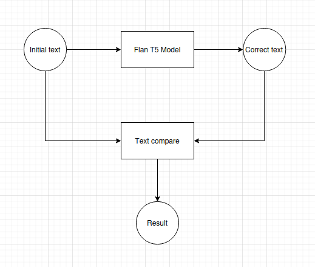
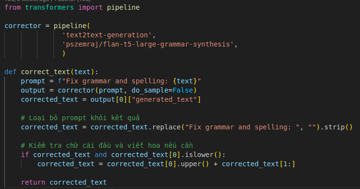
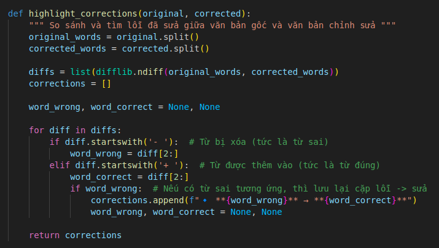

# Lexical_Review
[Tutorial](#tutorial)

[Basic design](#basic-design)

[Detail design](#detail-design)


## Tutorial 
1. Create virtual environment
   ```
   python3.10 -m venv myenv
   source myenv/bin/activate // for linux
   myenv\Scripts\activate // for windows
   ```
2. Install dependencies
   ```
   pip install -r requirements.txt
   ```
3. Run app
   ```
   streamlit run app.py --server.runOnSave false
   ```

## Basic design

* Input and Output
   - Input: Text that needs to be evaluated
   - Output: Number of errors, error ratio, error list and solution, corrected text.

* Flow
   - The text is fed into the pipeline of the pszemraj/flan-t5-large-grammar-synthesis model with the text2text-generation task. The prompt used is: "Fix grammar and spelling mistakes".
   - Compare the initial text with generated text to get the errors of initial text.
   - Output includes numbers of errors, error ratio, correct solution, corrected text.

## Detail design
### correct_text

* Flow
   - Using model **pszemraj/flan-t5-large-grammar-synthesis** with task **text2text-generation**.
   - Pass the initial text with prompt sentence "Fix grammar and spelling mistakes".
   - Remove prompt sentence from the generated text.
   - Check if the first letter is capital. If not, change first letter to capital form.
   - Return corrected text.

### highlight_corrections

* Flow
   - Pass the initial text and the corrected text to this function.
   - Tokenized both text into list of words.
   - Use the **difflib.ndiff()** function to get a list of differances between the initial text and corrected text
   - Return a list of incorrect word and its corresponding solution.


   
